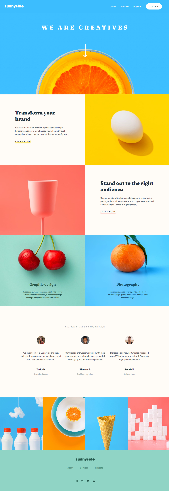

# Frontend Mentor - Sunnyside agency landing page solution

This is a solution to the [Sunnyside agency landing page](https://www.frontendmentor.io/challenges/sunnyside-agency-landing-page-7yVs3B6ef).

## Screenshot

## Links

- Solution URL: [here](https://www.frontendmentor.io/solutions/sunnyside-agency-landing-page-FxcYvMh3iF)
- Live Site URL: [here](https://sunnyside-agency-landing-page-inky.vercel.app/)

## Built with

- Semantic HTML5 markup
- Flexbox
- Mobile-first workflow
- [React](https://reactjs.org/) - JS frontend library
- [Vite js](https://vitejs.dev/) - Build tool
- [Tailwind](https://tailwindcss.com/) - For styles
